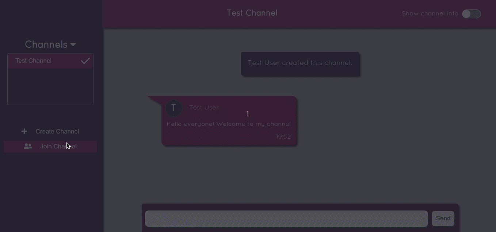
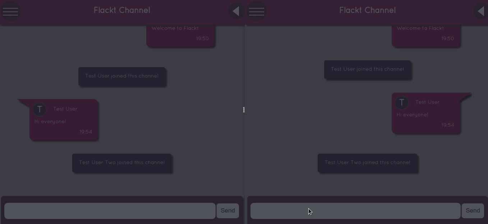

# Flackt

A simple group messaging web application that allows users to chat in real-time with group members.

### Project Development

This simple messaging app relies on sockets for bi-directional communication between the client side and the server side. The client-side socket logic utilizes the [socket.io](https://socket.io) library while the [Flask-SocketIO](https://flask-socketio.readthedocs/en/latest/) library manages connections in the backend. The backend is built using the Flask web microframework which handles user data, messages and channel data. The frontend uses the Handlebars Javascript templating library to handle user input and display group data.

All relevant data is stored in global variables defined in the Python backend while Javascript's locaStorage api stores data on the frontend. Once a display name is entered once, it gets stored and is retrieved whenever the site is opened in a browser.

### Technology used

| Technology     | Version | Utility                                                                                                                         |
| -------------- | ------- | ------------------------------------------------------------------------------------------------------------------------------- |
| Flask          | v2.0.2  | Python based web microframework                                                                                                 |
| Flask-SocketIO | v5.1.1  | Flask server that allows for real-time bi-directional communication and adds asynchronous functionality to the Flask framework. |
| Pytest         | v6.2.5  | Python testing library for building and running tests                                                                           |
| socket.io.js   | v4.4.1  | Javascript Library that facilitates bi-directional communication between the client and the server.                             |

## Setup and Installation

1. Launch your terminal.
2. Create a new folder and navigate to it.
3. Clone this github repository at https://github.com/ThatDudeJude/Flackt.
4. Ensure that [python](https://www.python.org) version v3.8+ and pip is installed in your computer.
5. Now create a new virtual environment and activate it. For Linux and Mac OS run `python3 -m venv venv && ./venv/bin/activate` . For Windows cmd.exe run `c:\>c:\Python38\python -m venv venv && venv/SCRIPTS/activate.bat` .
6. Install all required libraries.

```
python3 -m pip install -r requirements.txt
```

7.  To run the development server, set the environment variables below. Generate a secret key, typing in `python3 -c "import secrets; print(secrets.hex_token());" ` and use the output as the secret key.

```
    SECRET_KEY=[secret_key]
    FLASK_APP=flackt
    FLASK_ENV=development
```

Now run the application in the development environment

```
    flask run
```

Navigate to http://127.0.0.1:5000/ to view the application

## Tests

To run both e2e and unit tests make sure to press Ctrl + C to stop the server first.

For Mac and Linux users, run

```
    nohup python -m flask run > /dev/null &
    python3 -m pytest tests
```

To stop the flask server (in Mac and Linux) from running as a background process, run
`kill -9 $(lsof -i :5000 | awk 'FNR > 1 {print $2}')`.

On Windows CMD, run

```
    START /B python -m flask run > NUL 2>&1
    python3 -m pytest tests
```

## Screenshots and visuals

- First time display name
  
- Join channel
  
- Send Message
  

## Contributing

Want to contribute? See contributing guidelines [here](/CONTRIBUTING.md).

## Codebeat

[](https://codebeat.co/a/thatdudejude/projects/github-com-thatdudejude-flackt-main)

## License

[](LICENCE.txt)
